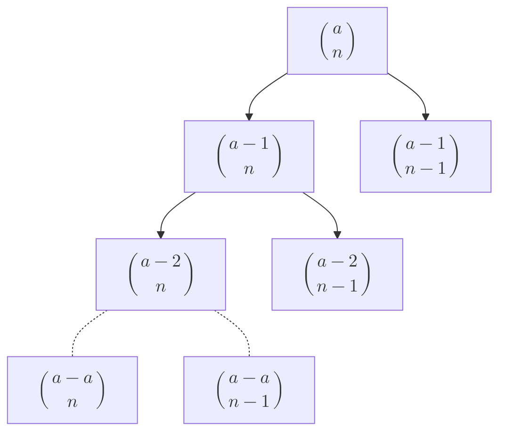

$$
\text{pascals identity} \\
\binom{a}{n} = \binom{a-1}{n} + \binom{a-1}{n-1} \\
\text{expand LHS a times }
$$

$$
\text{the expansion leaves $\sum_{b=0}^{a-1}\binom{b}{n-1} + \binom{0}{n}$ (reverse order sum $(a-a) \ldots (a-1)$)  } \\
\binom{a}{n}=\sum_{b=0}^{a-1} \left[\binom{b}{n-1}\right] + \binom{0}{n} \\
\text{expanding the sum terms using this identity $n-1$ times results in a nested sum of 1} \\
\binom{a}{n}=\sum_{b=0}^{a-1}\left[  \sum_{c=0}^{b-1}\left[\binom{c}{n-2}\right] + \binom{0}{n-1}   \right] + \binom{0}{n} \\
\binom{a}{n}=\sum_{b=0}^{a-1}\left[  \sum_{c=0}^{b-1}\left[ \ldots \sum_{n_{n}=0}^{n_{n-1}-1} \left[\binom{n_{n}}{n-n}\right] +\binom{0}{n-(n-1)}\ldots\right] + \binom{0}{n-1}   \right] + \binom{0}{n} \\
\text{since the terms are only expanded $n$ times the $\binom{0}{n}$ only reach $\binom{0}{1}=0$}\\
\binom{a}{n}=\sum_{b=0}^{a-1}  \sum_{c=0}^{b-1} \ldots \sum_{n_{n}=0}^{n_{n-1}-1}\left[\binom{n_{n}}{0} \right]   + \binom{0}{n} \\
\text{$\binom{a}{0}=1$ where $a>=0$} \\
\binom{a}{n}=\overbrace{\sum_{b=0}^{a-1}  \sum_{c=0}^{b-1} \ldots \sum_{n_{n}=0}^{n_{n-1}-1}\left[1 \right]}^{\text{$n$ sums}}   + \binom{0}{n} \\

$$